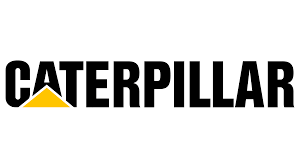

### Hi there 👋 I'm Chaoyu Fan/范朝宇

I am a MSEE student @ Columbia University  and a former Purdue Boilermaker.

### About Me 
- 🤩 I'm passionate about **Autonomous Driving**, **firmware development** and **full stack development**
- 🔭 I’m an **ex-intern** at Caterpillar CRDC .
- 🌱 I’m currently learning **embedded systems**, **cloud computing** and **machine learning**.
- 💬 I'm coding in **Java**, **Python**, and **JavaScript/TypeScript** recently.
- 📫 How to reach me: cf2859@columbia.edu

### Check out my Resume [HERE](https://www.linkedin.com/in/chaoyu-fan/overlay/1635502118882/single-media-viewer/)

<!--
**JakeFn123/JakeFn123** is a ✨ _special_ ✨ repository because its `README.md` (this file) appears on your GitHub profile.

Here are some ideas to get you started:

- 🔭 I’m currently working on ...
- 🌱 I’m currently learning ...
- 👯 I’m looking to collaborate on ...
- 🤔 I’m looking for help with ...
- 💬 Ask me about ...
- 📫 How to reach me: ...
- 😄 Pronouns: ...
- ⚡ Fun fact: ...
-->
