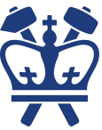

### Hi there 👋 I'm Chaoyu/朝宇

MSEE student @ Columbia University 

- 🔭 I’m currently working on finishing my last semester at Columbia University.
- 🌱 I’m currently learning software development.
- 👯 I’m looking to collaborate on full stack development projects.
- 🤔 I’m looking for help with data structures and algorithms. 
- 💬 Ask me about travel, food and music.
- 📫 How to reach me: cf2859@columbia.edu
- 😄 Pronouns: He/Him/His
- ⚡ Fun fact: I am a left handed person. 

<!--
**JakeFn123/JakeFn123** is a ✨ _special_ ✨ repository because its `README.md` (this file) appears on your GitHub profile.

Here are some ideas to get you started:

- 🔭 I’m currently working on ...
- 🌱 I’m currently learning ...
- 👯 I’m looking to collaborate on ...
- 🤔 I’m looking for help with ...
- 💬 Ask me about ...
- 📫 How to reach me: ...
- 😄 Pronouns: ...
- ⚡ Fun fact: ...
-->
